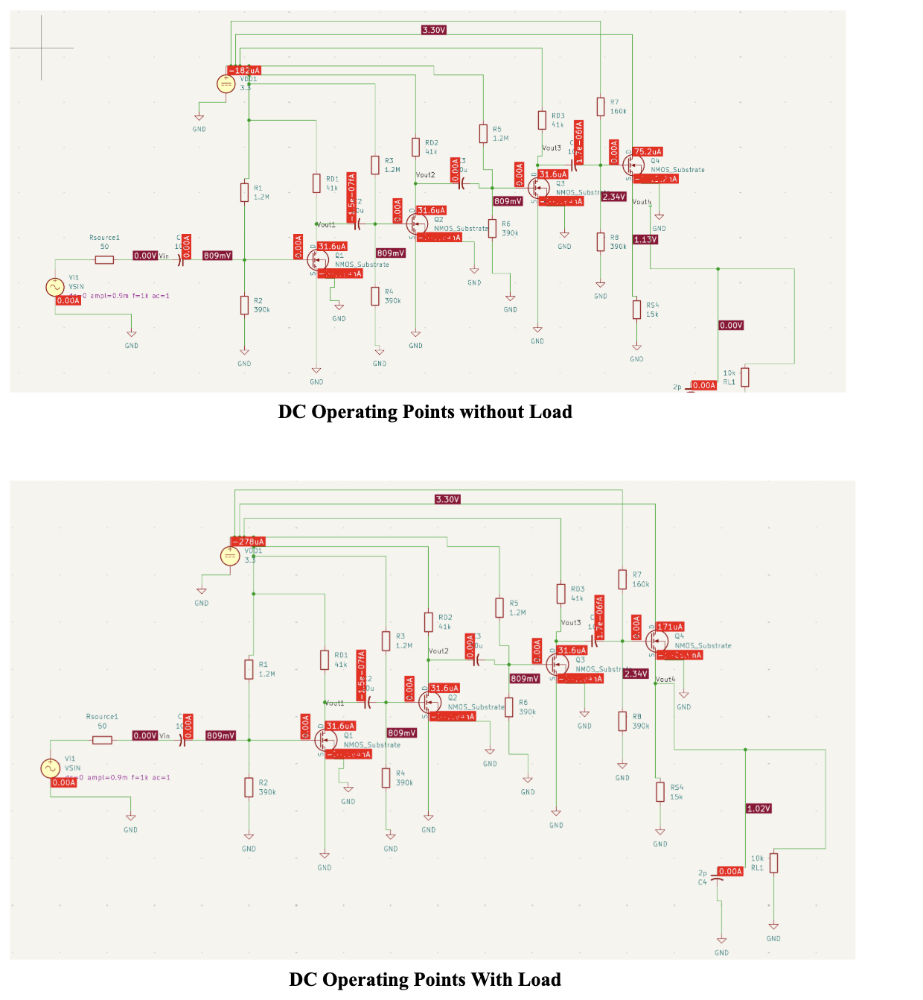
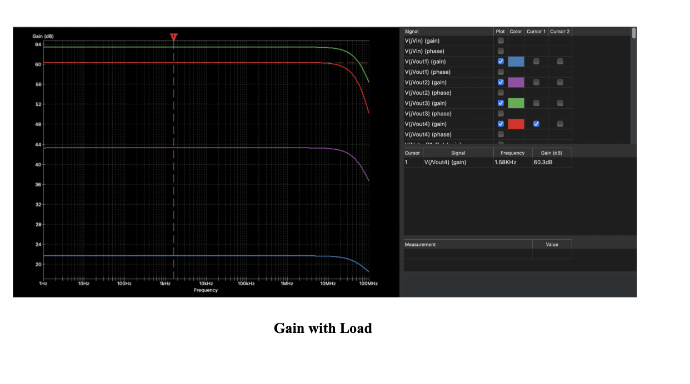
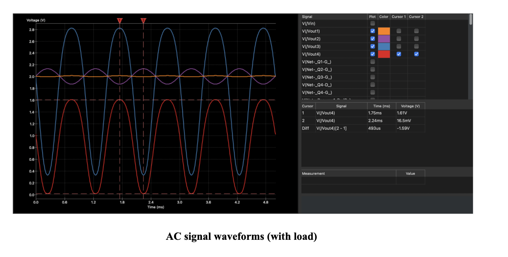

# 4-Stage MOSFET Amplifier

Adesign project implementing a **3.3 V, four-stage MOSFET amplifier** for sensor and mixed-signal applications. The amplifier conditions low-level analog signals for downstream acquisition and processing.

## Design

The amplifier consists of **three cascaded common-source gain stages** followed by a **source-follower output stage**. Transistor sizing and biasing were optimized to provide high gain, wide bandwidth, and low power consumption.

## Simulated Performance

| Parameter | Result |
| --- | --- |
| Supply voltage | 3.3 V |
| Voltage gain, unloaded | 60.9 dB |
| Voltage gain, with 10 kΩ load | 60.32 dB |
| Bandwidth, with 10 kΩ load | Approximately 45 MHz |
| Power consumption | Less than 1 mW |
| Output swing | Approximately 1.59 V peak-to-peak |
| Load resistance | 10 kΩ |

These results are based on SPICE simulations, not physical hardware measurements. Performance depends on the transistor models and simulation conditions.

## Tools

- **KiCad** — circuit schematic and project design
- **LTspice** — SPICE simulation and circuit verification

## Verification

The design was evaluated using:

- **DC operating-point analysis** to verify transistor biasing.
- **AC analysis** to evaluate gain and frequency response.
- **Transient analysis** to evaluate output swing and signal behavior.
- **10 kΩ load testing** to assess output drive and stable operation under the simulated conditions.

## Opening the Project

1. Download this repository or clone it to your computer.
2. Open the `.kicad_pro` file in KiCad to view the design.
3. Open any included LTspice `.asc` simulation files in LTspice.
4. Ensure any required transistor models or custom libraries are available before running simulations.

## Simulation Plots

### Circuit and DC Biasing

DC operating points for the four-stage amplifier, shown without a load and with a 10 kΩ load.

### Frequency Response with Load

Simulated frequency response with a 10 kΩ load; midband output gain: 60.32 dB.

### Transient Response with Load

Transient response with a 10 kΩ load; output swing: approximately 1.59 V peak-to-peak.

## Project Context

 April 2026.
